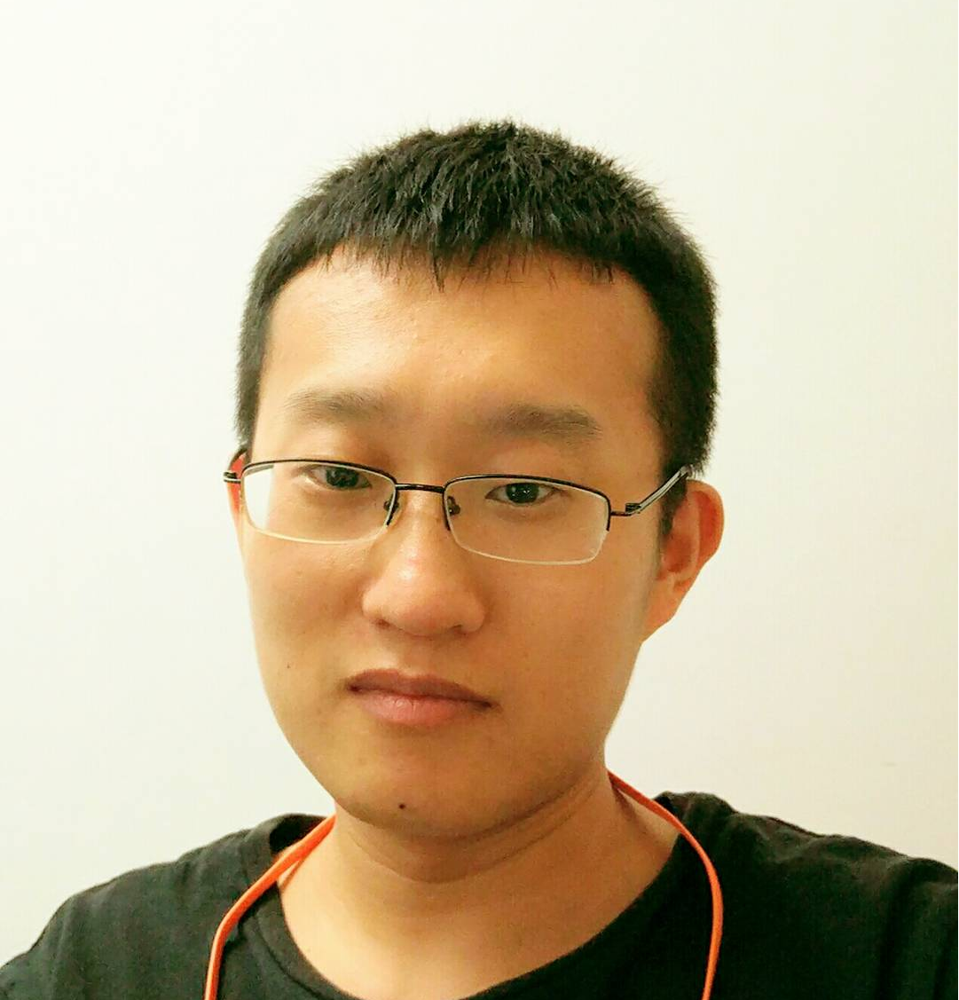

*B.S. Anhui U, M.S. UESTC, Ph.D. HKU* 

**Postdocal Fellow**  

**City University of Hong Kong**   

**Email**: xiaobing[at]eee.hku.hk  
   
**Office**: Room 15-236 (State Key Laboratory), 15/F, Lau Ming Wai Academic Building, City University of Hong Kong, 83 Tat Chee Avenue, Kowloon, Hong Kong SAR      
  

**Biography:**

Bing Xiao received the B.Sc. degree in applied physics from Anhui University, Hefei, China, in 2009, the M.Sc. degree in radio physics from University of Electronic Science and Technology of China (UESTC), Chengdu, China, in 2012, Ph.D. degree in electronic engineering at The University of Hong Kong, Hong Kong, China, in 2021. From 2021, he is a postdoc researcher in the State Key Laboratory of Terahertz and Millimeter Waves, Department of electrical engineering, City University of Hong Kong. His current research interests include antennas of smart devices and IoT. 
    

